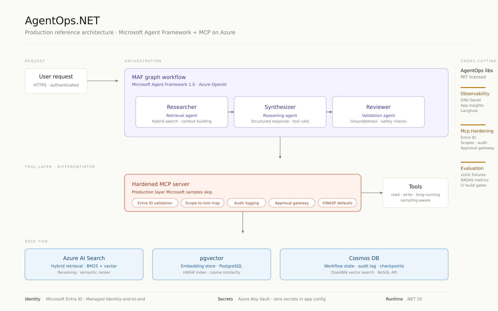

# AgentOps.NET

> The reference architecture and library suite for putting **Microsoft Agent Framework** + **Model Context Protocol** into production on Azure. Built for .NET 10. Opinionated. Boring on purpose.

[](https://www.nuget.org/packages/AgentOps.Observability)
[](https://www.nuget.org/packages/AgentOps.Mcp.Hardening)
[](https://www.nuget.org/packages/AgentOps.Evaluation)
[](https://github.com/pinusx-ai/agentops-dotnet/actions)
[](LICENSE)

> **Status:** Early development. Repo scaffolded. Libraries and reference workload coming. Star the repo to follow progress.

---

## What this is, and why it exists

Microsoft Agent Framework hit **1.0 GA on April 3, 2026**. The MCP C# SDK hit **1.0 in March 2026**. Both are production-grade. The official samples deliberately stop at "hello-world agent" and "single-page travel planner."

Every team going from sample to production hits the same three potholes in the same week:

1. **Observability** — `.UseOpenTelemetry()` is one line. Wiring OTel GenAI conventions to Application Insights *and* Langfuse, with cost / latency / tool-call dashboards and PII redaction, is bespoke per team and not in the docs.
2. **MCP server hardening** — the C# SDK supports OAuth, scopes, and DCR. Production-grade Entra ID + Managed Identity + Key Vault wiring, scope-to-tool authorization, audit logging, an approval gateway for destructive tools, and OWASP-aligned guardrails are left as exercises.
3. **Agent evaluation in CI** — Azure AI Evaluation SDK exists. RAGAS exists. xUnit exists. A working pattern that runs golden-set evals on every PR, fails the build on regression, and tracks drift across MAF agents and workflows is not yet a public reference in C#.

This repo closes all three. Use the libraries independently or scaffold the whole stack with `dotnet new agentops`.

---

## The Microsoft-skips-this matrix

| Production concern | Official Microsoft sample | What's missing | What this repo provides |
|---|---|---|---|
| Tracing & observability | `.UseOpenTelemetry()` one-liner in MAF samples | Cost-per-trace, tool-call spans, agent-handoff spans, PII filters, Langfuse export, sampling presets | `AgentOps.Observability` NuGet + Application Insights + Langfuse dashboards |
| MCP auth | `WithHttpTransport()` with OAuth scopes example | Entra ID validation middleware, scope-to-tool maps, signed tool descriptions, audit logging | `AgentOps.Mcp.Hardening` NuGet |
| Destructive tool calls | "Add human-in-the-loop" mentioned in docs | Runnable approval gateway with web UI, OWASP-aligned defaults | `IApprovalGateway` + reference UI in `samples/` |
| OWASP MCP threats | Linked from MS Learn | SSRF defaults, redirect-URI validation, state-parameter checks, tool-poisoning defenses | Built into `AgentOps.Mcp.Hardening` |
| Agent evaluation in CI | Azure AI Evaluation SDK quickstart | xUnit fixtures, golden YAML test cases, PR-comment reporters, regression gates | `AgentOps.Evaluation` NuGet |
| End-to-end reference workload | Travel-planner single-agent demo | Multi-agent graph, hybrid retrieval, Cosmos + pgvector + Azure AI Search, Entra-secured | `samples/contoso-knowledge-assistant` |
| Infrastructure-as-code | Bicep snippets per service | Single `azd up` deploy of full stack | Bicep + `azure.yaml` |

---

## Architecture

Three specialist agents (Researcher, Synthesizer, Reviewer) coordinated by a MAF graph workflow. Hybrid retrieval over Azure AI Search + pgvector, structured state in Cosmos DB. MCP server exposes four tools — one read-only, one write-with-approval, one long-running, one tool-with-sampling. All requests flow through Entra ID; secrets live in Key Vault; identity is Managed.

Reference workload is a vertical-agnostic Q&A assistant over a synthetic public-domain corpus (Contoso). Replace the corpus, keep the architecture.



---

## 5-minute quickstart

> **Note:** Quickstart is being implemented. Watch this repo to get notified when the first release lands.

Prerequisites: .NET 10 SDK, Azure Developer CLI (`azd`), an Azure subscription with OpenAI access.

```bash
# Scaffold a new project from the template
dotnet new install AgentOps.Templates
dotnet new agentops -n MyAgent
cd MyAgent

# Deploy everything
azd up

# Open the assistant
azd show
```

What you get on first run:
- A working multi-agent assistant at `https://<your-app>.azurecontainerapps.io`
- OpenTelemetry traces flowing to Application Insights *and* Langfuse
- An MCP server already behind Entra ID, with audit logs in Cosmos
- A passing eval gate in GitHub Actions
- A blocking approval prompt the first time the agent tries a destructive tool

Tear down with `azd down`.

---

## The three libraries

### `AgentOps.Observability`

Drop-in OTel GenAI + Application Insights + Langfuse with sane defaults.

```csharp
builder.Services.AddAgentOpsObservability(options =>
{
    options.AppInsightsConnectionString = builder.Configuration["AppInsights:ConnectionString"];
    options.LangfuseEndpoint = builder.Configuration["Langfuse:Endpoint"];
    options.RedactPii = true;
    options.SamplingRatio = 0.25;
});
```

Captures: model + version, prompt + completion tokens, cost-per-trace, tool-call spans, agent-handoff spans, MCP server/tool labels, retrieval recall metrics. PII filter is regex-extensible.

### `AgentOps.Mcp.Hardening`

ASP.NET Core middleware for the MCP C# SDK. Adds the production layer Microsoft's sample doesn't.

```csharp
builder.Services
    .AddMcpServer()
    .WithHttpTransport()
    .WithAgentOpsHardening(options =>
    {
        options.RequireEntraId(builder.Configuration["EntraId:Authority"]);
        options.MapScopeToTool("tools.read",  "search_documents");
        options.MapScopeToTool("tools.write", "create_ticket");
        options.RequireApprovalFor("create_ticket", "delete_record");
        options.EnableAuditLog<CosmosAuditLogger>();
        options.UseOwaspDefaults();
    });
```

Includes: Entra ID validation, scope-to-tool maps, signed tool descriptions, structured audit logs (Cosmos / SQL / file), `IApprovalGateway` interface with a reference web UI, OWASP-aligned defaults for SSRF, redirect-URI, state-parameter, and tool-poisoning defenses.

### `AgentOps.Evaluation`

xUnit fixtures + a small DSL that runs Azure AI Evaluation SDK + RAGAS metrics from golden YAML. Emits Markdown PR comments. Fails the build on regression.

```csharp
public class ResearcherAgentEvals : AgentEvaluationFixture<ResearcherAgent>
{
    [Theory]
    [GoldenSet("evals/researcher.golden.yaml")]
    public async Task Should_meet_quality_bar(EvalCase @case)
    {
        var result = await EvaluateAsync(@case);

        Assert.True(result.Groundedness   >= 0.85);
        Assert.True(result.Relevance      >= 0.80);
        Assert.True(result.RagasFaithful  >= 0.75);
    }
}
```

---

## Why these defaults

Senior engineers read the ADRs before the README. We do too. ADRs land alongside each library:

- ADR-001: Why three libraries instead of one framework
- ADR-002: Why OTel GenAI conventions over a custom schema
- ADR-003: Why Langfuse alongside Application Insights
- ADR-004: Why Entra ID is the only first-class auth path
- ADR-005: Why the approval gateway is synchronous by default
- ADR-006: Why xUnit, not a bespoke eval runner
- ADR-007: Why hybrid retrieval (Azure AI Search + pgvector)
- ADR-008: Why the GA-only API surface, with previews quarantined to `/labs`

---

## Threat model & OWASP mapping

The MCP hardening library maps directly to the **OWASP Practical Guide for Secure MCP Server Development** and the **OWASP GenAI Top 10**.

| OWASP concern | Default in this library |
|---|---|
| Tool poisoning / unsigned tool descriptions | Tool descriptions signed at registration; signature verified per call |
| Confused-deputy / SSRF in tool execution | Outbound HTTP egress allowlist; URL validator |
| Token theft via redirect-URI tampering | Strict redirect-URI registration; state parameter required |
| Privilege escalation via scope drift | Scope-to-tool map enforced at middleware layer, not in tool code |
| Audit gap on destructive ops | Audit log emitted before tool dispatch, with idempotency key |
| Prompt injection via tool output | Tool outputs flagged with provenance metadata; agents see source labels |

---

## Compatibility matrix

| Component | Tested versions |
|---|---|
| .NET | 10.0 |
| Microsoft Agent Framework | 1.0.0, 1.0.x |
| MCP C# SDK | 1.0.0, 1.0.x |
| Azure OpenAI | GPT-5.2, GPT-5.1, GPT-4o |
| Azure AI Search | 2024-07-01-Preview and later GA |
| Cosmos DB | NoSQL API, vector search (DiskANN) |
| pgvector | 0.7.0+ |
| Azure regions | eastus2, westus3, westeurope, swedencentral |

GA-only on the public surface. Preview features quarantined in `/labs` and explicitly labelled.

---

## Production checklist

Copy this into your own project's PR template.

- [ ] OTel exporter to Application Insights configured with cost-per-trace
- [ ] Langfuse export enabled in non-prod for prompt/output review
- [ ] PII redaction filters reviewed against your data classification
- [ ] Sampling ratio set per environment (1.0 in dev, 0.1–0.25 in prod)
- [ ] Entra ID authority and audience pinned per environment
- [ ] Scope-to-tool map reviewed by security owner
- [ ] Approval gateway wired for every destructive tool
- [ ] Audit log destination tested for retention + query SLA
- [ ] Golden-set evals exist for every agent and workflow
- [ ] Regression thresholds set in CI; PR fails on regression
- [ ] Threat model reviewed against OWASP GenAI Top 10
- [ ] Managed Identity used end-to-end; zero secrets in app config
- [ ] Key Vault references resolved at startup, not runtime
- [ ] Cost ceiling alerting on Azure OpenAI and Azure AI Search
- [ ] `azd down` rehearsed in non-prod

---

## What this project is *not*

To keep scope honest:

- **Not a vertical solution.** No healthcare, no claims, no aviation, no MRO, no parts management, no maintenance workflow, no defense or aerospace patterns. The Contoso reference workload is deliberately generic.
- **Not a competitor to Microsoft Agent Framework.** It depends on MAF and tracks its public API surface. When MAF adds a feature this repo provides, the repo deprecates.
- **Not a replacement for Azure AI Evaluation SDK or RAGAS.** It composes them.
- **Not a low-code platform.** No Copilot Studio, no Power Platform.
- **Not opinionated about which LLM you use.** Bring your own. Defaults to Azure OpenAI; documented swap paths to Anthropic via Foundry, OpenAI direct, and OSS via Foundry Local.

---

## Repository layout

```
agentops-dotnet/
├── samples/
│   └── contoso-knowledge-assistant/    # End-to-end reference workload
├── src/
│   ├── AgentOps.Observability/         # NuGet
│   ├── AgentOps.Mcp.Hardening/         # NuGet
│   ├── AgentOps.Evaluation/            # NuGet
│   └── AgentOps.Templates/             # `dotnet new agentops`
├── labs/                               # Preview-feature samples (not GA-stable)
├── docs/
│   ├── decisions/                      # ADRs
│   ├── threat-model.md
│   ├── evaluation.md
│   └── img/
├── infra/                              # Bicep + azure.yaml
├── tests/
│   ├── AgentOps.Observability.Tests/
│   ├── AgentOps.Mcp.Hardening.Tests/
│   └── AgentOps.Evaluation.Tests/
└── .github/
    └── workflows/
```

---

## Contributing

Issues and PRs welcome. Please read [CONTRIBUTING.md](CONTRIBUTING.md) — short, no surprises.

This project follows the [Microsoft Open Source Code of Conduct](https://opensource.microsoft.com/codeofconduct/).

---

## About

Built and maintained by **Hari Prakash**, founder of [Pinusx AI](https://pinusx.com) — production AI systems on .NET and Azure.

12+ years building production .NET systems across enterprise SaaS. 2+ years shipping production agentic AI: zero-hallucination text-to-SQL on a live ERP (Semantic Kernel + Cosmos DB vector search), and a 14-stage multi-agent orchestrator (Kerno).

Available for senior advisory and implementation engagements on Microsoft Agent Framework migrations, MCP server hardening, and production agent reliability.

- LinkedIn: [linkedin.com/in/hariprakashdb](https://linkedin.com/in/hariprakashdb)
- Engagements: [pinusx.com/contact](https://pinusx.com/contact)
- Email: info@pinusx.com

---

## License

MIT. See [LICENSE](LICENSE).
