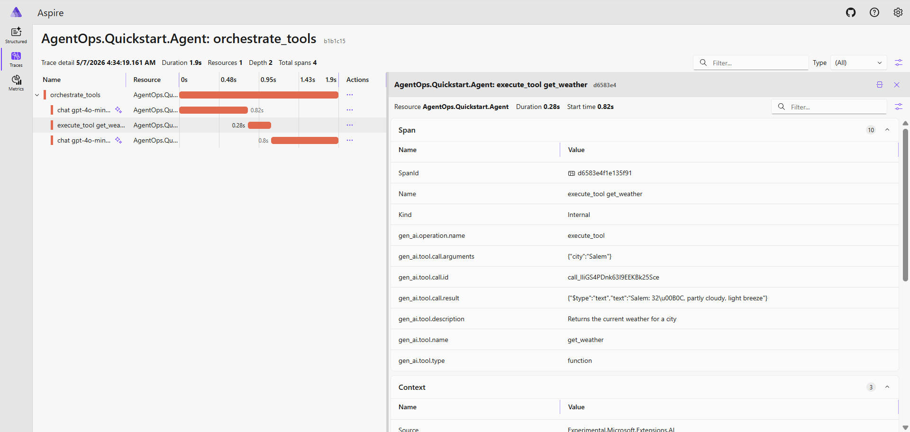

# 01 — MAF + MCP quickstart

The smallest end-to-end sample that exercises Microsoft Agent Framework, Model Context Protocol, and OpenTelemetry GenAI on .NET 10. One agent, one MCP server, full distributed tracing.

## Components

```
01-maf-mcp-quickstart/
├── agent/        # MAF-based chat agent. Spawns the MCP server, routes tool calls.
└── mcp-server/   # MCP server exposing two tools (GetWeather, ListCities).
```

The two-process split is the educational point — it mirrors the production shape of MCP, where the tool layer is a separate process with a separate trust boundary.

## What you'll see



A single *"what's the weather in Salem?"* round-trip:

- **Total: 1.9 s**
- **LLM round-trips: ~85%** — 1.62 s across two `chat gpt-4o-mini` spans (first selects the tool, second synthesizes the result)
- **Tool execution: 280 ms**

Every span is tagged with OpenTelemetry GenAI Semantic Conventions (`gen_ai.usage.input_tokens`, `gen_ai.tool.call.arguments`, `gen_ai.tool.call.result`, and so on). The conventions make traces immediately analyzable on any compliant backend — Aspire Dashboard, Application Insights, Langfuse, Datadog. See [ADR-002](../../docs/decisions/ADR-002-otel-genai-over-custom-schema.md) for why.

## Run it

**Prerequisites**
- .NET 10 SDK
- An OpenAI API key
- An Aspire Dashboard reachable over OTLP gRPC (local or remote)

**Environment variables**

```bash
export OPENAI_API_KEY=sk-...

# Optional — defaults to http://localhost:4317 if unset
export OTEL_EXPORTER_OTLP_ENDPOINT=http://<your-aspire-host>:4317
```

**Build and run**

From the repo root:

```bash
dotnet build agentops-dotnet.slnx
cd samples/01-maf-mcp-quickstart/agent
dotnet run
```

The agent automatically spawns `mcp-server` as a subprocess. Type prompts in the interactive loop; an empty line exits.

Try:
- *"what time is it in UTC?"* — hits `AgentTools.GetCurrentTime`
- *"what's the weather in Salem?"* — hits the MCP server's `WeatherTools.GetWeather`
- *"tell me about Cosmos DB"* — hits `AgentTools.LookupAzureService`

Traces appear in Aspire Dashboard in real time.

## What this surfaced

Three observations from building this end-to-end:

1. **The `Microsoft.Extensions.AI` middleware pipeline is the right injection point for observability.** `UseOpenTelemetry()` drops in cleanly on `ChatClientBuilder`. Tagging is automatic via OTel GenAI Semantic Conventions — no custom schema. Detailed in [ADR-002](../../docs/decisions/ADR-002-otel-genai-over-custom-schema.md).

2. **The three concerns AgentOps.NET addresses inject at three architecturally distinct points.** Observability hooks the chat-client middleware. MCP hardening hooks the server's transport/auth layer. Evaluation runs out-of-process. That's why the project ships as three libraries, not one framework — see [ADR-001](../../docs/decisions/ADR-001-three-libraries-not-one-framework.md).

3. **Most production agent latency budget is the LLM, not your code.** ~85% LLM, ~15% tool execution, negligible orchestration overhead. That changes how you optimize, where you cache, and what you instrument.

## Known limitations

This is a v0.1 sample. Things that are intentionally simple, with the rationale:

- **The MCP server isn't OpenTelemetry-instrumented on its side.** The agent's traces show `execute_tool get_weather` as a span — but that's the agent's view of the call. True end-to-end cross-process tracing requires the MCP server to also emit OTLP and propagate W3C TraceContext via stdio. The MCP spec doesn't yet standardize transport-level context propagation.
- **No exception handling in the chat loop.** A network blip or rate limit kills the agent. Intentional — failures surface visibly. Production code wraps `agent.RunAsync` with retry and graceful degradation.
- **No cancellation token threading.** Long-running LLM calls can't be interrupted mid-flight.
- **Tool implementations are hardcoded.** `GetWeather` returns mock data; `LookupAzureService` is a switch with four entries. The point is the architecture, not the tools.

These get addressed progressively as the libraries (`AgentOps.Observability`, `AgentOps.Mcp.Hardening`, `AgentOps.Evaluation`) and subsequent samples land.

## Where this fits

Sample `01` in a planned progression:

| Sample | Status | What it adds |
|---|---|---|
| `01-maf-mcp-quickstart` | shipped | Single agent + MCP server + OTel tracing |
| `02-multi-agent-graph` | planned | Researcher / Synthesizer / Reviewer in a MAF graph workflow |
| `03-hardening-walkthrough` | planned | MCP server with Entra ID + scopes + audit + approval gateway |
| `contoso-knowledge-assistant` | planned | Comprehensive end-to-end: multi-agent + hardened MCP + hybrid retrieval over Azure AI Search + pgvector + Cosmos |

## History

This sample originated as an exploratory single-commit spike at [pinusx-ai/agentops-learning](https://github.com/pinusx-ai/agentops-learning). The polish, structuring, namespace rename, and `await using` lifecycle fix happened during the move into this repo.